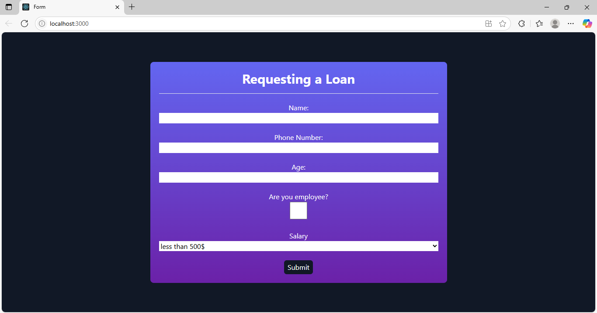

# Loan Request Form

## Demo

[View Live Demo](https://loan-request-form.vercel.app/)



> To run the project locally:
>
> 1. Install dependencies:
>    ```bash
>    npm install
>    ```
> 2. Start the development server:
>    ```bash
>    npm start
>    ```
> 3. Open your browser at [http://localhost:3000](http://localhost:3000)

This is a simple React web application that allows users to request a loan by filling out a form. The app collects basic information such as name, phone number, age, employment status, and salary range. It provides instant feedback if the information is invalid and confirms successful submission.

## Features

- Easy-to-use loan request form
- Validates phone number and age
- Saves form data in your browser (local storage)
- Shows popup messages for errors and success
- Responsive and modern design using Tailwind CSS

## How to Run the App

1. **Install dependencies:**
   ```bash
   npm install
   ```
2. **Start the development server:**
   ```bash
   npm start
   ```
3. Open your browser and go to [http://localhost:3000](http://localhost:3000)

## Usage

- Fill in your name, phone number, and age.
- Select if you are an employee and choose your salary range.
- Click the submit button.
- You will see a popup message if there is an error or if your request is successful.
- After a successful submission, the form will reset.

## Notes

- Phone number must be 10-12 digits.
- Age must be between 18 and 100.
- All data is stored only in your browser and is not sent anywhere.

## Technologies Used

- React
- Tailwind CSS

---

This project was bootstrapped with [Create React App](https://github.com/facebook/create-react-app).
